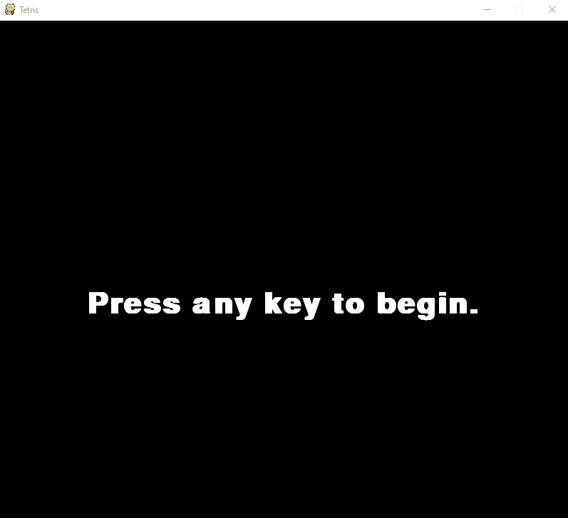

# PythonTetris
A Tetris game written in Pyton.

## Getting Started

Before you clone the repository you first want to make sure you have Python3. Also make sure you have pygame installed as well.

`pip3 install pygame`

Once pygame is downloaded you can then clone.

`git clone https://github.com/Googlymonster/PythonTetris.git`

To run the game enter the following code in the terminal.

`python3 tetris.py`

To play use the left/right arrow keys to move. The up arrow key will rotate the piece. The down arrow key will lower the piece down further. The game keeps track of the score for each row complete and will maintain you highest score. See how high you can get your score.

### Have Fun

